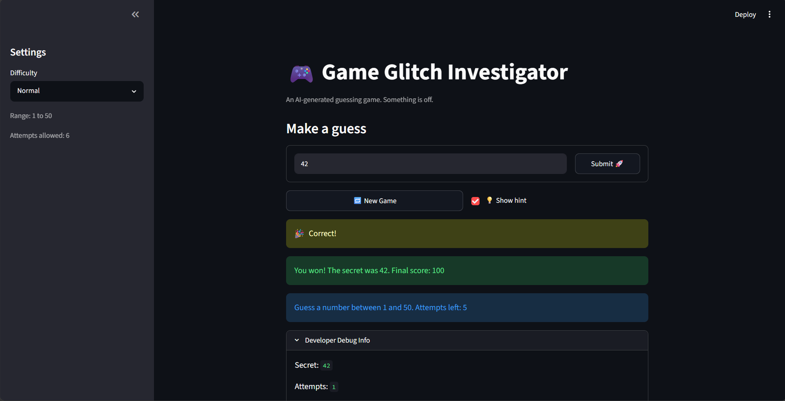

# 🎮 Game Glitch Investigator: The Impossible Guesser

## 🚨 The Situation

You asked an AI to build a simple "Number Guessing Game" using Streamlit.
It wrote the code, ran away, and now the game is unplayable. 

- You can't win.
- The hints lie to you.
- The secret number seems to have commitment issues.

## 🛠️ Setup

1. Install dependencies: `pip install -r requirements.txt`
2. Run the broken app: `python -m streamlit run app.py`

## 🕵️‍♂️ Your Mission

1. **Play the game.** Open the "Developer Debug Info" tab in the app to see the secret number. Try to win.
2. **Find the State Bug.** Why does the secret number change every time you click "Submit"? Ask ChatGPT: *"How do I keep a variable from resetting in Streamlit when I click a button?"*
3. **Fix the Logic.** The hints ("Higher/Lower") are wrong. Fix them.
4. **Refactor & Test.** - Move the logic into `logic_utils.py`.
   - Run `pytest` in your terminal.
   - Keep fixing until all tests pass!

## 📝 Document Your Experience

- [ ] Describe the game's purpose.
- [ ] Detail which bugs you found.
- [ ] Explain what fixes you applied.

## 📸 Demo Walkthrough

Describe your fixed game in numbered steps so a reader can follow along without watching a video:

1.  User enters a guess of 30 and clicks the enter key or press the submit button
2. Game returns "📈 Go HIGHER!"
3. User enters a guess of 50 and clicks the enter key or press the submit button -> "📉 Go LOWER!"
4. Attempts decreases by 1 each time and score is decreased
5. User guesses 46 (the correct guess), the game ends, and the user has the chance to reset the game to try again

**Screenshot** *(optional)*: <!-- Insert a screenshot of your fixed, winning game here -->

## 🧪 Test Results

```
============================================================================== test session starts ==============================================================================
collected 10 items                                                                                                                                                              
tests\test_game_logic.py .......                                                                                                                                                                                                                                           [100%]

============================================================================== 10 passed in 0.05s ===============================================================================
```

## 🚀 Stretch Features

- [ ] [If you choose to complete Challenge 4, describe the Enhanced UI changes here — a screenshot is optional]

The enhanced UI changes I made was reorganizing the buttons and form layout for submitting your guess. In order to allow the user to submit their guess by clicking enter, I needed to create a form where the submit button was also in the form. This meant that the 3 column layout for the submit button, reset game, and show hint was messsed up. This led to me using AI to reformat the web application and get a visual that was more pleasing and organized.